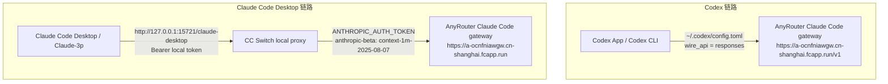

# CC Switch + AnyRouter 配置 Codex 和 Claude Code Desktop 新手指南

更新时间：2026-06-15

这份指南记录当前这台 Mac 已经跑通的两套配置：

- Codex 通过 CC Switch 管理配置，走 AnyRouter 的 OpenAI Responses 兼容接口。
- Claude Code Desktop 通过 CC Switch 本地代理，走 AnyRouter 的 Claude Code 兼容网关。

先记住两句话：

> Codex 用 OpenAI Responses 兼容配置。  
> Claude Code Desktop 用本机 CC Switch 代理配置。

不要把两套配置混在一起。

## 1. 总体技术方案

### 1.1 两条链路不一样



### 1.2 为什么 Codex 和 Claude Desktop 不一样

Codex 本身可以读 `~/.codex/config.toml`，所以 CC Switch 可以直接帮它写好模型、base_url、wire_api、key。

Claude Code Desktop 不能直接照普通 AnyRouter API 配。它当前跑通方式是：

1. Claude Code Desktop 连接本机 CC Switch。
2. CC Switch 本地代理接住请求。
3. CC Switch 用 AnyRouter key 转发到 Claude Code 兼容网关。

所以两边的配置重点不同：

| 应用 | 谁保存 AnyRouter key | 应用连接哪里 | API 格式 |
|---|---|---|---|
| Codex | `~/.codex/auth.json` / CC Switch Codex provider | `https://a-ocnfniawgw.cn-shanghai.fcapp.run/v1` | OpenAI Responses |
| Claude Code Desktop | CC Switch `claude-desktop` provider | `http://127.0.0.1:15721/claude-desktop` | Anthropic / Claude Desktop proxy |

## 2. 当前本机配置快照

### 2.1 Codex 当前配置

CC Switch 当前 Codex provider：

| 字段 | 当前值 |
|---|---|
| App type | `codex` |
| Provider name | `Anyroute` |
| Provider ID | `d220c6fe-fbff-4163-9672-0f1c19ad37f8` |
| 当前 provider | 是 |
| API format | `openai_responses` |
| endpointAutoSelect | true |
| commonConfigEnabled | false |

Codex 文件位置：

```text
~/.codex/config.toml
~/.codex/auth.json
```

当前 `~/.codex/config.toml` 关键内容：

```toml
model = "gpt-5.5"
model_provider = "anyrouter"
preferred_auth_method = "apikey"
model_reasoning_effort = "xhigh"
disable_response_storage = true
personality = "pragmatic"

[model_providers.anyrouter]
name = "anyrouter"
base_url = "https://a-ocnfniawgw.cn-shanghai.fcapp.run/v1"
wire_api = "responses"
requires_openai_auth = true

[features]
goals = true
js_repl = false
memories = true

[memories]
generate_memories = true
use_memories = true
```

当前 `~/.codex/auth.json` 关键内容：

```json
{
  "OPENAI_API_KEY": "<你的 AnyRouter API key>"
}
```

验证结果：CC Switch 的 Codex 请求日志里，`gpt-5.5` 最近多次返回 `200`。

### 2.2 Claude Code Desktop 当前配置

CC Switch 当前 `claude-desktop` provider：

| 字段 | 当前值 |
|---|---|
| App type | `claude-desktop` |
| Provider name | `AnyRouter [1M beta]` |
| Provider ID | `9039c947-75f8-4e78-8669-0d2ad0b52667` |
| Base URL | `https://a-ocnfniawgw.cn-shanghai.fcapp.run` |
| Auth env | `ANTHROPIC_AUTH_TOKEN` |
| Custom headers | `anthropic-beta: context-1m-2025-08-07` |
| API format | `anthropic` |
| Mode | `proxy` |

Claude Code Desktop profile 位置：

```text
~/Library/Application Support/Claude-3p/configLibrary/00000000-0000-4000-8000-000000157210.json
~/Library/Application Support/Claude-3p/configLibrary/_meta.json
```

当前 Desktop profile：

| 字段 | 当前值 |
|---|---|
| Profile name | `CC Switch` |
| Gateway URL | `http://127.0.0.1:15721/claude-desktop` |
| Auth scheme | `bearer` |
| Local gateway token | CC Switch 本地 token |
| 当前活动模型 | `claude-opus-4-8[1m]` |

当前模型路由：

| Desktop 请求模型 | CC Switch 转发上游模型 | 菜单显示名 | 1M |
|---|---|---|---|
| `claude-haiku-4-5` | `claude-haiku-4-5-20251001` | `claude-haiku-4-5-20251001` | 否 |
| `claude-opus-4-8` | `claude-opus-4-8[1M]` | `claude-opus-4-8` | 是 |
| `claude-sonnet-4-6` | `claude-sonnet-4-5-20250929[1M]` | `claude-sonnet-4-5-20250929` | 是 |

## 3. 新电脑配置前准备

准备：

1. 安装 CC Switch。
2. 安装 Codex。
3. 安装 Claude Code Desktop / Claude Desktop 3p 版本。
4. 准备 AnyRouter API key。
5. 先分别打开一次这些 App，让它们创建本地配置目录。

建议配置顺序：

```text
先配 Codex -> 再配 Claude Code Desktop
```

原因：Codex 配置更简单，容易先验证 AnyRouter key 是否可用。

## 4. Codex 怎么配

### 4.1 用 CC Switch 图形界面配置 Codex

打开 CC Switch，进入 Codex 的 provider 配置，新建或编辑 provider。

按下面填：

| 界面字段大概叫法 | 填入内容 | 说明 |
|---|---|---|
| App / Target | `codex` | 选择 Codex 应用 |
| Provider name | `Anyroute` 或 `AnyRouter` | 名字随便，建议能看懂 |
| API format | `openai_responses` | 关键，Codex 走 Responses |
| Model | `gpt-5.5` | 当前本机跑通模型 |
| Model provider | `anyrouter` | 要和 config 里的 provider 名一致 |
| Auth key name | `OPENAI_API_KEY` | Codex 使用 OpenAI 风格 key 名 |
| API key | 你的 AnyRouter API key | 会写入 `~/.codex/auth.json` |
| Base URL | `https://a-ocnfniawgw.cn-shanghai.fcapp.run/v1` | 注意末尾有 `/v1` |
| Wire API | `responses` | 不要选 chat/completions |
| Requires OpenAI auth | true / 勾选 | 使用 `OPENAI_API_KEY` |
| Reasoning effort | `xhigh` | 当前本机配置 |
| Disable response storage | true / 勾选 | 当前本机配置 |

### 4.2 Codex 对应的 TOML 配置

如果需要手动检查或迁移，关键配置如下：

```toml
model = "gpt-5.5"
model_provider = "anyrouter"
preferred_auth_method = "apikey"
model_reasoning_effort = "xhigh"
disable_response_storage = true
personality = "pragmatic"

[model_providers.anyrouter]
name = "anyrouter"
base_url = "https://a-ocnfniawgw.cn-shanghai.fcapp.run/v1"
wire_api = "responses"
requires_openai_auth = true
```

`~/.codex/auth.json` 里应该有：

```json
{
  "OPENAI_API_KEY": "你的 AnyRouter API key"
}
```

### 4.3 Codex 配通怎么判断

在 CC Switch 请求日志里看 Codex：

```zsh
sqlite3 ~/.cc-switch/cc-switch.db "
select app_type,model,request_model,status_code,substr(coalesce(error_message,''),1,160),created_at
from proxy_request_logs
where app_type='codex'
order by created_at desc
limit 12;"
```

看到类似这样就说明通了：

```text
codex|gpt-5.5|gpt-5.5|200||
```

### 4.4 Codex 常见错误

| 现象 | 通常原因 | 处理 |
|---|---|---|
| 401 / unauthorized | `OPENAI_API_KEY` 不对或没写入 | 检查 `~/.codex/auth.json` |
| 404 model not found | 模型名不被当前网关支持 | 先用 `gpt-5.5` |
| responses 相关报错 | `wire_api` 填错 | 改成 `responses` |
| 请求没走 AnyRouter | `model_provider` 名不匹配 | 确认 `model_provider = "anyrouter"` 和 `[model_providers.anyrouter]` 一致 |

## 5. Claude Code Desktop 怎么配

Claude Code Desktop 不要照 Codex 那套直接填 `/v1`。它走本机 CC Switch 代理。

### 5.1 先配 CC Switch 的 Claude Desktop provider

在 CC Switch 里进入 `Claude Desktop` / `claude-desktop` provider。

基础信息按下面填：

| 界面字段大概叫法 | 填入内容 | 说明 |
|---|---|---|
| App / Target | `claude-desktop` | 选择 Claude Desktop |
| Provider name | `AnyRouter [1M beta]` | 建议这样命名 |
| Base URL | `https://a-ocnfniawgw.cn-shanghai.fcapp.run` | 注意这里没有 `/v1` |
| Auth type / Auth env | `ANTHROPIC_AUTH_TOKEN` | 不是 `OPENAI_API_KEY` |
| Token | 你的 AnyRouter API key | 这里填 AnyRouter key |
| Custom headers | `anthropic-beta: context-1m-2025-08-07` | 1M 必需 |
| API format | `anthropic` | 不要选 OpenAI |
| Mode | `proxy` | 使用 CC Switch 本地代理 |

注意：

- Codex 的 Base URL 有 `/v1`。
- Claude Desktop provider 的 Base URL 没有 `/v1`。

### 5.2 配 Claude Desktop 模型路由

#### Haiku

| 字段 | 填入 |
|---|---|
| Desktop model / Request model | `claude-haiku-4-5` |
| Upstream model / Target model | `claude-haiku-4-5-20251001` |
| Label override | `claude-haiku-4-5-20251001` |
| supports1m | false / 不勾选 |

#### Opus 4.8

| 字段 | 填入 |
|---|---|
| Desktop model / Request model | `claude-opus-4-8` |
| Upstream model / Target model | `claude-opus-4-8[1M]` |
| Label override | `claude-opus-4-8` |
| supports1m | true / 勾选 |

#### Sonnet

| 字段 | 填入 |
|---|---|
| Desktop model / Request model | `claude-sonnet-4-6` |
| Upstream model / Target model | `claude-sonnet-4-5-20250929[1M]` |
| Label override | `claude-sonnet-4-5-20250929` |
| supports1m | true / 勾选 |

不要把 `Label override` 写成 `xxx[1M]`。

Claude Code Desktop 会自己生成：

```text
xxx (1M context)
```

如果 label 也写 `[1M]`，菜单里会出现一个假的 `[1M]` 普通项，选了会 400。

### 5.3 启动 CC Switch 本地代理

Claude Code Desktop 需要 CC Switch 监听：

```text
127.0.0.1:15721
```

检查命令：

```zsh
nc -z 127.0.0.1 15721 && echo "CC Switch proxy is up"
```

### 5.4 配 Claude Code Desktop 的 API 页面

打开 Claude Code Desktop 的 API / Gateway / Provider 设置。

按下面填：

| 界面字段大概叫法 | 填入内容 | 说明 |
|---|---|---|
| Provider | Gateway / Custom API | 使用自定义网关 |
| Base URL / Gateway URL | `http://127.0.0.1:15721/claude-desktop` | 连接本机 CC Switch |
| Auth Scheme | `Bearer` | 本地代理鉴权 |
| API Key / Token | CC Switch 给 Desktop 的本地 token | 不是 AnyRouter key |
| Model Discovery | 关闭，或使用本地模型列表 | 避免菜单乱掉 |

再次强调：

```text
Claude Code Desktop 里不要填 AnyRouter key。
```

### 5.5 Claude Desktop 模型列表

如果需要手动填模型列表：

```json
[
  {
    "name": "claude-haiku-4-5",
    "labelOverride": "claude-haiku-4-5-20251001"
  },
  {
    "name": "claude-opus-4-8",
    "labelOverride": "claude-opus-4-8",
    "supports1m": true
  },
  {
    "name": "claude-sonnet-4-6",
    "labelOverride": "claude-sonnet-4-5-20250929",
    "supports1m": true
  }
]
```

## 6. 使用时怎么选模型

### 6.1 Codex

Codex 当前使用：

```text
gpt-5.5
```

如果能正常对话，且 CC Switch 日志里 `codex|gpt-5.5|...|200`，说明配置成功。

### 6.2 Claude Code Desktop

第一次验证先选：

```text
claude-haiku-4-5-20251001
```

Haiku 能回复，说明基础链路正常。

要用 Opus 4.8，选：

```text
claude-opus-4-8 (1M context)
```

要用 Sonnet，选：

```text
claude-sonnet-4-5-20250929 (1M context)
```

不要选普通的：

```text
claude-opus-4-8
claude-sonnet-4-5-20250929
```

普通项不带 1M，会报 400。

## 7. 常见报错

### 7.1 Claude Desktop 报 400，提示启用 1M

报错类似：

```text
400: 1m 上下文已经全量可用，请启用 1m 上下文后重试
```

原因：选了普通模型项。

解决：选择带 `(1M context)` 的模型。

### 7.2 Claude Desktop 报 429 / 503

报错类似：

```text
Server is temporarily limiting requests
Request rejected (429) · Service Unavailable
```

原因：请求已经到 AnyRouter 上游，但上游限流或不可用。

处理：

1. 不要连续重试。
2. 等 5-10 分钟。
3. 先切 Haiku 验证基础链路。
4. 如果 Haiku 通，Opus/Sonnet 429，就是上游模型限流。

### 7.3 Claude Desktop 连不上 API

检查 CC Switch 本地代理：

```zsh
nc -z 127.0.0.1 15721 && echo "CC Switch proxy is up"
```

如果不通：

1. 打开 CC Switch。
2. 确认 `claude-desktop` provider 是当前启用的 provider。
3. 确认 CC Switch proxy 开启。

### 7.4 Codex 401

检查：

```text
~/.codex/auth.json
```

里面应该有：

```json
{
  "OPENAI_API_KEY": "你的 AnyRouter API key"
}
```

### 7.5 Codex 模型或接口报错

检查 `~/.codex/config.toml`：

```toml
model = "gpt-5.5"
model_provider = "anyrouter"

[model_providers.anyrouter]
base_url = "https://a-ocnfniawgw.cn-shanghai.fcapp.run/v1"
wire_api = "responses"
requires_openai_auth = true
```

重点是：

- `base_url` 要有 `/v1`
- `wire_api` 要是 `responses`
- `model_provider` 要和 `[model_providers.anyrouter]` 名字一致

## 8. 检查命令

### 8.1 检查 Codex 当前配置

```zsh
ruby -e '
p=File.expand_path("~/.codex/config.toml")
s=File.read(p).gsub(/sk-[A-Za-z0-9_-]+/,"<redacted-key>")
puts s
'
```

### 8.2 检查 Codex key 是否存在

```zsh
ruby -rjson -e '
p=File.expand_path("~/.codex/auth.json")
j=JSON.parse(File.read(p))
j.each{|k,v| j[k]="<redacted> len=#{v.to_s.length}" if k =~ /(KEY|TOKEN|SECRET|PASSWORD|AUTH)/i}
puts JSON.pretty_generate(j)
'
```

### 8.3 检查 CC Switch 的 Codex provider

```zsh
ruby -rjson -rsqlite3 -e '
def redact(obj)
  case obj
  when Hash
    obj.each_with_object({}) do |(k,v),h|
      if k.to_s =~ /(KEY|TOKEN|SECRET|PASSWORD|AUTH)/i
        h[k] = "<redacted> len=#{v.to_s.length}"
      else
        h[k] = redact(v)
      end
    end
  when Array
    obj.map { |v| redact(v) }
  when String
    obj.gsub(/sk-[A-Za-z0-9_-]+/, "<redacted-key>")
  else
    obj
  end
end

db=SQLite3::Database.new(File.expand_path("~/.cc-switch/cc-switch.db"))
db.results_as_hash=true
r=db.get_first_row("select id,name,settings_config,meta,is_current from providers where app_type=? and is_current=1","codex")
puts "id=#{r["id"]}"
puts "name=#{r["name"]}"
puts "is_current=#{r["is_current"]}"
puts JSON.pretty_generate(redact(JSON.parse(r["settings_config"]||"{}")))
puts JSON.pretty_generate(redact(JSON.parse(r["meta"]||"{}")))
'
```

### 8.4 检查 CC Switch 的 Claude Desktop provider

```zsh
ruby -rjson -rsqlite3 -e '
db=SQLite3::Database.new(File.expand_path("~/.cc-switch/cc-switch.db"))
db.results_as_hash=true
r=db.get_first_row("select name,settings_config,meta from providers where app_type=? and is_current=1","claude-desktop")
s=JSON.parse(r["settings_config"]||"{}")
m=JSON.parse(r["meta"]||"{}")
env=s["env"]||{}
env.each{|k,v| env[k]="<redacted>" if k =~ /(KEY|TOKEN|SECRET|PASSWORD|AUTH)/i}
puts "provider=#{r["name"]}"
puts JSON.pretty_generate(s)
puts JSON.pretty_generate(m)
'
```

### 8.5 看请求日志

Codex：

```zsh
sqlite3 ~/.cc-switch/cc-switch.db "
select app_type,model,request_model,status_code,substr(coalesce(error_message,''),1,160),created_at
from proxy_request_logs
where app_type='codex'
order by created_at desc
limit 12;"
```

Claude Desktop：

```zsh
sqlite3 ~/.cc-switch/cc-switch.db "
select app_type,model,request_model,status_code,substr(coalesce(error_message,''),1,160),created_at
from proxy_request_logs
where app_type='claude-desktop'
order by created_at desc
limit 12;"
```

## 9. 可选：claude-fable-5

当前主工作配置没有保留 `claude-fable-5`。

如果要加到 Claude Desktop：

| 字段 | 填入 |
|---|---|
| Desktop model / Request model | `claude-fable-5` |
| Upstream model / Target model | `claude-fable-5[1M]` |
| Label override | `claude-fable-5` |
| supports1m | true / 勾选 |

使用时选：

```text
claude-fable-5 (1M context)
```

如果 Fable 报 429 / Service Unavailable，说明 AnyRouter 的 Fable 上游限流，不是本地配置冲突。

## 10. 截图建议

如果要做图文版教程，建议截这几张：

1. CC Switch 的 Codex provider 配置页：
   - model
   - model_provider
   - base_url
   - wire_api
   - OPENAI_API_KEY
2. CC Switch 的 Claude Desktop provider 配置页：
   - Base URL
   - ANTHROPIC_AUTH_TOKEN
   - Custom headers
3. CC Switch 的 Claude Desktop 模型路由页：
   - Haiku
   - Opus
   - Sonnet
   - supports1m
4. Claude Code Desktop 的 API / Gateway 设置页：
   - `http://127.0.0.1:15721/claude-desktop`
   - Bearer
   - 本地 token
5. Claude Code Desktop 的模型菜单：
   - `claude-opus-4-8 (1M context)`
   - `claude-sonnet-4-5-20250929 (1M context)`

截图前遮住所有 API key 和 token。

## 11. 不要做这些事

- 不要把 Claude Desktop 的 Base URL 填成 `https://anyrouter.top`。
- 不要把 Claude Desktop 的 Base URL 填成 Codex 的 `/v1` 地址。
- 不要把 AnyRouter key 填进 Claude Code Desktop。
- 不要把 Claude 模型 Label 写成 `xxx[1M]`。
- 不要把 Codex 的 `wire_api` 改成 `chat` 或 `chat/completions`。
- 不要连续快速重试 Claude 1M 模型，容易触发 429 和 CC Switch 熔断。

